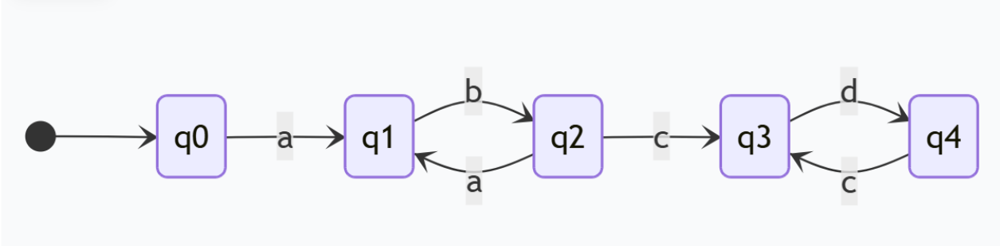
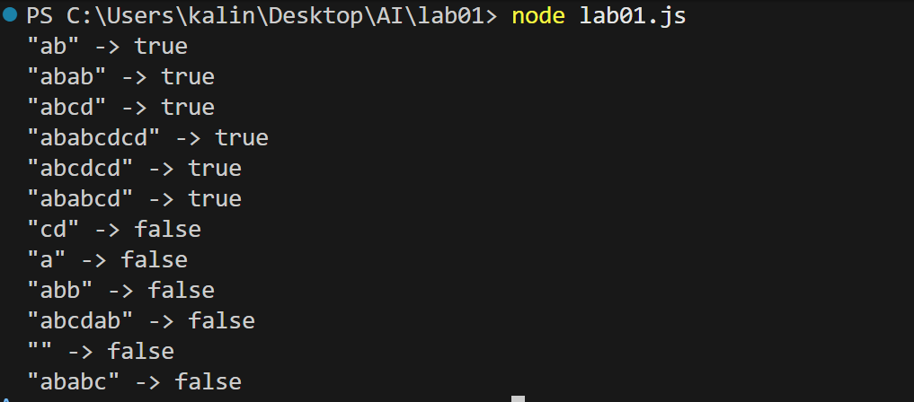

# Лабораторная работа №1
 
 - **Калинкова София, I2302** 

## Цель работы

Целью лабораторной работы является освоение основ работы с конечными автоматами и правктическая реализация алгоритма.

## Ход работы

### Задание
Написать программу реализующую ĸонечный автомат, ĸоторый распознает слова, имеющие следующий общий вид:
. 

***2 вариант*** (ab)^n * (cd)^m, n≥1,m≥0

### Диаграмма состояний DFA
. 

### Реализация в коде
[Код программы на JS](lab01.js)

### Тестирование

**Вывод программы**



```cs
string[] tests = {
    "ab",          // true, n=1, m=0
    "abab",        // true, n=2, m=0
    "abcd",        // true, n=1, m=1
    "ababcdcd",    // true, n=2, m=2
    "cd",          // false, n must be >=1
    "a",           // false
    "abb",         // false
    "abcdab",      // false, нельзя возвращаться к ab после начала cd
    "",            // false, n>=1
    "abcdcd",      // true, n=1, m=2
    "ababcd",      // true, n=2, m=1
    "ababc",       // false, не завершена пара в cd (после c нужен d)
};
```

## Вывод

В ходе лабораторной работы была реализована программа на JS, моделирующая детерминированный конечный автомат для распознавания слов вида (ab)^n * (cd)^m, n≥1,m≥0. Построена диаграмма состояний, выполнена пошаговая проверка работы алгоритма и проведено тестирование на различных входных данных.
Результаты показали, что автомат корректно обрабатывает как правильные, так и ошибочные цепочки, что подтверждает правильность реализации.