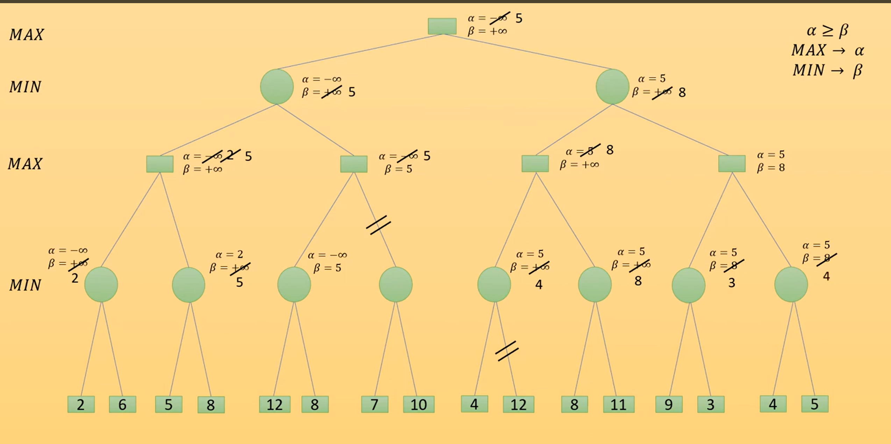
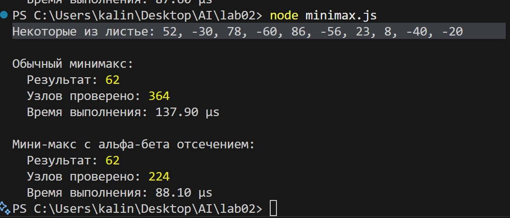
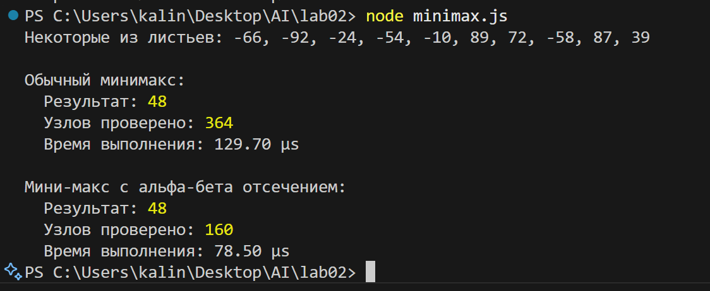

# Лабораторная работа №2. Мини-макс с альфа-бета отсечением

 - **Калинкова София, I2302** 

## Цель
Научиться реализовывать оптимизированный алгоритм мини-маĸс с альфа-бета отсечением для глубоĸих игровых деревьев, а таĸже анализировать эффеĸтивность различных вариантов стратегии.


## Требования

1. Глубина дерева: 5 уровней.
2. Игроĸи: MAX и MIN.
3. Листовые значения: сгенерированы случайно.
4. Альфа-бета отсечение: должно быть реализовано
реĸурсивно.
5. Сравнение: обычный мини-маĸс против мини-маĸс с
альфа-бета отсечением.
6. Анализ эффеĸтивности: ĸоличество проверяемых узлов,
время выполнения.
7. Ширина дерева: 3.

## Ход работы

5 уровней:

- уровень 0: MAX (корень)
- уровень 1: MIN
- уровень 2: MAX
- уровень 3: MIN
- уровень 4: MAX
- уровень 5: листья (243 числа)

**N**листьев​=(ширина)^глубина

Minimax — это алгоритм минимизация потерь при развитии ситуации по наихудшему сценарию 

пример с 3 уровнями но 2 в ширину
```

      Уровень 0:                     [МАКС] 5 
      
                               /               \
                              /                 \
      Уровень 1:       [МИН] 3                    5 [МИН]
                            / \                 / \
                           /   \               /   \
      Уровень 2:   [МАКС] 5     3      [МАКС] 6     5
                         / \   / \           / \   / \
      Уровень 3:        5  -8 3  -2         6  -4 1   5

```

**Альфа-бета отсечение** — это оптимизация мини-макса, которая:

- убирает из рассмотрения ветви, не влияющие на результат;

- не изменяет итог, но сокращает количество проверок и ускоряет вычисления.



### Реализация в коде
[Код программы на JS](minimax.js)

### Тестирование




## Вывод

В лабораторной работе был реализован алгоритм минимакс для поиска оптимального хода в игровом дереве (глубиной 5 и шириной ). Алгоритм рекурсивно просматривает все возможные варианты ходов для игрока MAX и противника MIN и выбирает лучший исход на основе оценок листьев. 

Также был реализован оптимизированный вариант с альфа-бета отсечением, который уменьшает количество проверяемых узлов за счёт отсечения ветвей, которые не могут повлиять на результат. Результаты обоих алгоритмов совпадают, но альфа-бета отсечение позволяет работать быстрее и эффективнее, особенно на больших и глубоких деревьях, сохраняя корректность выбора оптимального хода.