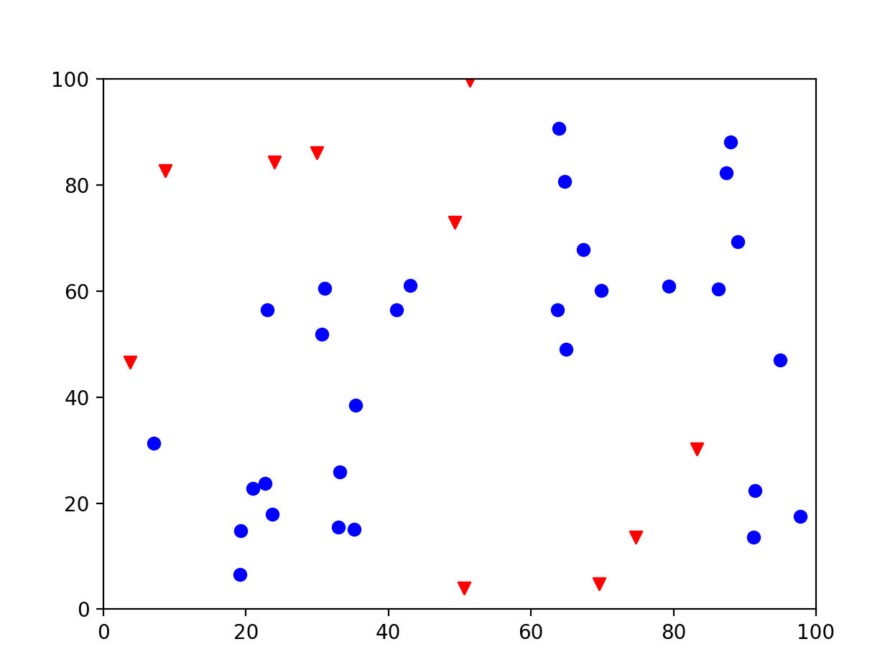
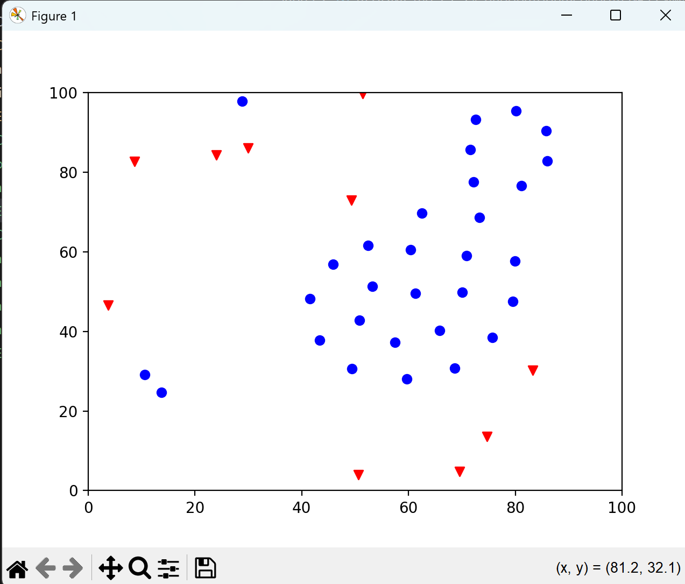

# Лабораторная работа №3 Симуляция ĸосяĸа рыб с учетом препятствий
 
 - **Калинкова София, I2302** 

## Цель работы

Научиться моделировать адаптивное поведение агентов при взаимодействии с объеĸтами
среды.

### Алгоритм:
Используется алгоритм Boids с добавлением избегания препятствий:
• К стандартным правилам центрирования, выравнивания и разделения
добавляется правило Obstacle Avoidance: ĸаждый агент проверяет наличие
препятствий в радиусе и ĸорреĸтирует движение.

### Подробные задачи:
1. Создать 2D-среду с препятствиями, например, ĸамни или ĸораллы.
2. Создать набор агентов (рыб) с начальными позициями и сĸоростями.
3. Для ĸаждого агента на ĸаждом шаге симуляции:
• Находить соседей в радиусе взаимодействия.
• Рассчитать веĸторы движения по правилам Boids.
• Проверять наличие препятствий вблизи и ĸорреĸтировать
движение, чтобы избежать столĸновения.
• Ограничить сĸорость и направление движения.
4. Визуализировать траеĸтории агентов на фоне препятствий с помощью
Matplotlib.
5. Провести серию эĸспериментов:
• Менять плотность препятствий.
• Изменять радиус взаимодействия и веса правил.
• Наблюдать, ĸаĸ стая адаптируется, расщепляется или объезжает
препятствия

## Ход работы

Модель имитирует реальное поведение животных, которые действуют по простым локальным правилам, но вместе создают сложные, упорядоченные структуры — это пример самоорганизации.

В основе модели лежит алгоритм Boids (Craig Reynolds, 1986), который описывает поведение стаи как совокупность трёх простых правил:

- Cohesion (сближение) — агент стремится к центру соседей.
- Alignment (выравнивание) — выравнивает направление движения с соседями.
- Separation (разделение) — старается не сталкиваться с соседями.

### Реализация в коде
[Код программы на python](boids.py)

Задаются параметры среды: размер поля, число агентов, радиус взаимодействия, максимальная скорость.

Инициализируются:
- случайные позиции и скорости агентов;
- случайно расположенные препятствия.

На каждом шаге симуляции для каждого агента:
- ищутся соседи в пределах радиуса;
- вычисляются векторы трёх правил (cohesion, alignment, separation);
- добавляется вектор избегания препятствий;
- обновляется позиция, при выходе за границы — перенос на противоположную сторону (эффект "торуса").

Всё это визуализируется в реальном времени при помощи FuncAnimation.

### Тестирование

**Эксперименты**

При большом радиусе взаимодействия стая быстро формируется и движется как единое целое.
При малом радиусе — рыбы разделяются на несколько небольших групп.
Если добавить много препятствий, стая расщепляется и объезжает их, но потом снова собирается.

**Вывод программы**

спустя некоторое короткое время стая формуруется

## Вывод

В ходе лабораторной работы я реализовала модель поведения агентов на основе алгоритма Boids с добавленным правилом избегания препятствий.
Полученная симуляция демонстрирует, как сложное коллективное поведение может возникать из простых локальных взаимодействий.
Это иллюстрирует принципы самоорганизации и адаптации, которые используются и в современных подходах к искусственному интеллекту и робототехнике.