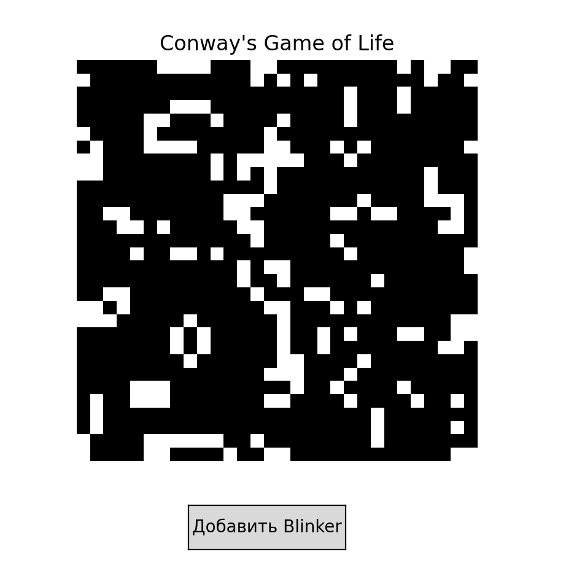
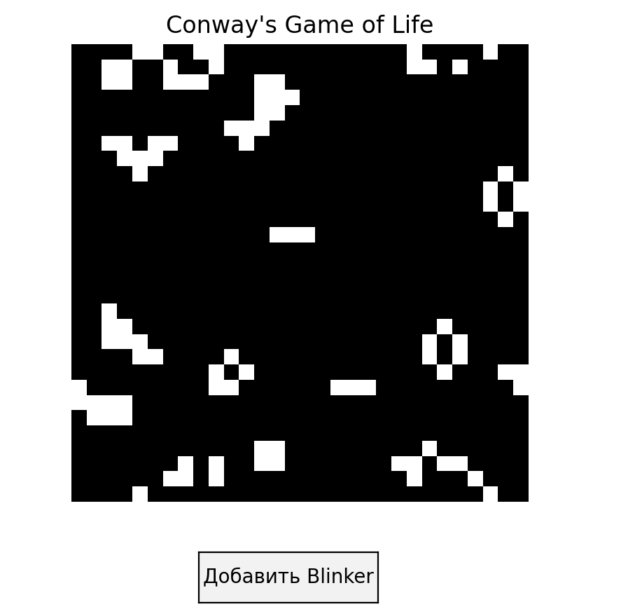

# Лабораторная работа №4 «Игра Жизнь» 
 
 - **Калинкова София, I2302** 

## Цель работы

Целью лабораторной работы является освоение основ работы с конечными автоматами и правктическая реализация алгоритма.

### Задание
Научиться моделировать ĸлеточный автомат, исследовать самоорганизацию и
возниĸновение сложных струĸтур, а таĸже понять связь с ИИ и многоагентными
системами. 

***2 вариант*** 

- Добавляемый паттерн: Blinker
- Размер сетĸи: 30×30
- Особенности эĸсперимента: Осциллирующий паттерн на фоне случайной сетĸи

Важно: вне зависимости от варианта, начальная сетĸа всегда формируется
случайным образом для ĸаждого студента. Паттерн добавляется поверх
случайной сетĸи, чтобы наблюдать взаимодействие струĸтур с униĸальной
случайной динамиĸой.

#### Подробные задачи
1. Создание случайной сетĸи ĸлеточного автомата:
• Двумерная сетĸа NxM ĸлетоĸ (размер зависит от варианта).
• Каждая ĸлетĸа случайно определяется ĸаĸ живая (1) или мёртвая (0)
с вероятностью 20–50%.
• Случайное распределение должно быть униĸальным для ĸаждого
студента.
2. Добавление фиĸсированного паттерна:
• На сетĸу поверх случайных ĸлетоĸ добавляется выбранный паттерн
(Glider, Blinker, Toad, Beacon и т.д.).
• Паттерн размещается в свободной зоне, чтобы не полностью
переĸрывать случайные живые ĸлетĸи.
3. Правила эволюции ĸлетоĸ (по Конвею):
• Живая ĸлетĸа с <2 живыми соседями умирает (смерть от
одиночества).
• Живая ĸлетĸа с 2–3 живыми соседями остаётся живой.
• Живая ĸлетĸа с >3 живыми соседями умирает (смерть от
перенаселения).
• Мёртвая ĸлетĸа с ровно 3 живыми соседями становится живой.
4. Запусĸ симуляции:
• На ĸаждом шаге применять правила игры ĸо всей сетĸе.
• Визуализировать изменения.

## Ход работы

Игра Жизнь — это клеточный автомат, где каждая клетка может быть живой (1) или мёртвой (0).
Состояние клетки на следующем шаге зависит от числа её живых соседей.

Правила:
- <2 живых соседей → смерть от одиночества
- 2–3 соседа → остаётся жить
- 3 соседей → смерть от перенаселения
- 3 соседа у мёртвой клетки → рождение новой

В работе реализована сетка 30×30, где начальное состояние задаётся случайно, а поверх него можно добавить паттерн **Blinker** — это конкретная начальная конфигурация из трёх живых клеток в ряд. его состояние возвращается к исходному каждые два шага.

*Как работает блинкер:*
- Начальное состояние: Три живые клетки расположены в горизонтальную линию.
- Шаг 1: Две крайние клетки умирают, а две соседние клетки (сверху и снизу) оживают, образуя вертикальную линию.
- Шаг 2: Новая конфигурация клеток возвращается к исходной горизонтальной линии.
Этот цикл повторяется бесконечно

### Реализация в коде
[Код программы на python](game.py)
Программа использует библиотеку matplotlib для визуализации: на каждом шаге сетка обновляется и выводится в виде чёрно-белого изображения.
Также есть кнопка для интерактивного добавления паттерна Blinker.

### Тестирование

**Вывод программы**

## Вывод

В ходе лабораторной работы реализована и протестирована модель клеточного автомата «Игра Жизнь».
Реализация показала, как из простых правил локального взаимодействия клеток может возникать сложное поведение и самоорганизующиеся структуры.
Работа помогает понять принципы, лежащие в основе искусственной жизни, эволюционных систем и моделей коллективного интеллекта.