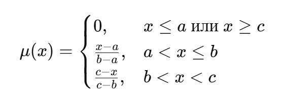
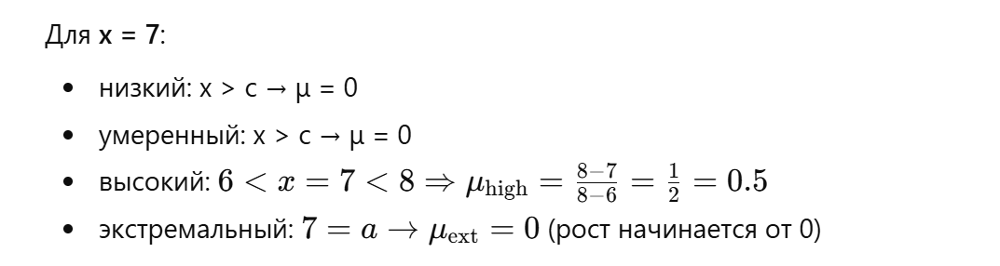
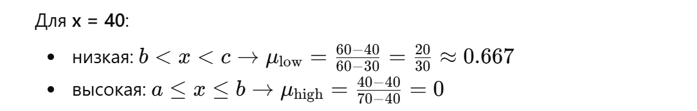
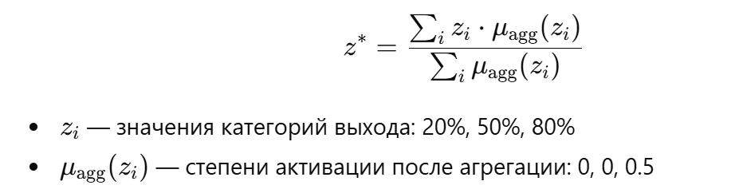
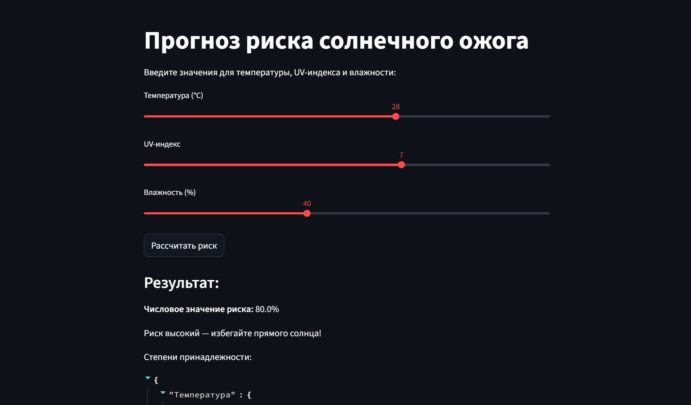
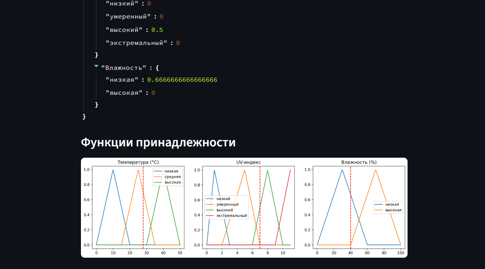

# Лабораторная работа №5. 
## Вариант 2. Прогнозирование солнечной аĸтивности и рисĸа ожога

 - **Калинкова София, I2302** 

## Цель:

Применение нечетĸой логиĸи для оценĸи рисĸа солнечного ожога с возможностью интераĸтивного ввода данных.

## Ход работы

### 1. Входные переменные и категории

| Вход                 | Категории                                 | Диапазон              | Форма функции |
| -------------------- | ----------------------------------------- | --------------------- | ------------- |
| **Температура (°C)** | низкая, средняя, высокая                  | -10–10, 5–25, 20–40    | треугольные   |
| **UV-индекс**        | низкий, умеренный, высокий, экстремальный | 0–2.5, 2–5, 4–8, 7–11 | треугольные   |
| **Влажность (%)**    | низкая, высокая                           | 0–60, 40–100          | треугольные   |

> Температура представлена тремя категориями, влажность представлена двумя, а UV-индекс — четырьмя, что даёт 3 × 4 × 2 = 24 правил.

### 2. Выходная переменная

	Вероятность ожога (z) (0–100%)

| Категория риска | Диапазон | Тип функции | Интерпретация                                             |
| --------------- | -------- | ----------- | --------------------------------------------------------- |
| **Низкий**      | 0–30     | треугольная | безопасно, можно находиться на солнце без особой защиты   |
| **Средний**     | 20–70    | треугольная | возможен ожог при длительном пребывании, требуется защита |
| **Высокий**     | 60–100   | треугольная | высокий риск ожога, требуется максимальная защита         |

### 3. База правил (Rule Base)

Всего 24 правила (3×4×2 комбинации).

Правила задаются экспертно, с учётом того, что:

- На риск больше всего влияет UV-индекс.
- Температура усиливает эффект UV.
- Влажность слегка снижает риск (за счёт рассеивания и охлаждения кожи).

**Примеры правил**

|  №  | Температура |       UV      | Влажность | Риск ожога |
| :-: | :---------: | :-----------: | :-------: | :--------: |
|  1  |    низкая   |     низкий    |   низкая  |   низкий   |
|  2  |    низкая   |     низкий    |  высокая  |   низкий   |
|  3  |    низкая   |   умеренный   |   низкая  |   средний  |
|  4  |    низкая   |   умеренный   |  высокая  |   низкий   |
|  5  |    низкая   |    высокий    |   низкая  |   высокий  |
|  6  |    низкая   |    высокий    |  высокая  |   средний  |
|  7  |    низкая   | экстремальный |   низкая  |   высокий  |
|  8  |    низкая   | экстремальный |  высокая  |   высокий  |
|  9  |   средняя   |     низкий    |   низкая  |   низкий   |
|  10 |   средняя   |     низкий    |  высокая  |   низкий   |
|  11 |   средняя   |   умеренный   |   низкая  |   средний  |
|  12 |   средняя   |   умеренный   |  высокая  |   средний  |
|  13 |   средняя   |    высокий    |   низкая  |   высокий  |
|  14 |   средняя   |    высокий    |  высокая  |   высокий  |
|  15 |   средняя   | экстремальный |   низкая  |   высокий  |
|  16 |   средняя   | экстремальный |  высокая  |   высокий  |
|  17 |   высокая   |     низкий    |   низкая  |   низкий   |
|  18 |   высокая   |     низкий    |  высокая  |   низкий   |
|  19 |   высокая   |   умеренный   |   низкая  |   средний  |
|  20 |   высокая   |   умеренный   |  высокая  |   средний  |
|  21 |   высокая   |    высокий    |   низкая  |   высокий  |
|  22 |   высокая   |    высокий    |  высокая  |   высокий  |
|  23 |   высокая   | экстремальный |   низкая  |   высокий  |
|  24 |   высокая   | экстремальный |  высокая  |   высокий  |

### 4. Фаззификация

Пусть измеренные значения:

- Температура = 28°C
- UV-индекс = 7
- Влажность = 40%

Определим степени принадлежности для каждого параметра:

**Температура**

Расчеты:

Низкая: x > c → μ = 0

Средняя: x > c → μ = 0

Высокая: Левая часть: μ = (28-25)/(35-25) = 3/10 = 0.3

**UV-индекс** 

**Влажность**

| Переменная      | Категория     |  Значение μ |
| --------------- | ------------- | ----------- |
| **Температура** | низкая        | 0           |
|                 | средняя       | 0           | 
|                 | высокая       | 0.3         |
| **UV-индекс**   | низкий        | 0           | 
|                 | умеренный     | 0           | 
|                 | высокий       | 0.5         | 
|                 | экстремальный | 0           | 
| **Влажность**   | низкая        | 0.7         | 
|                 | высокая       | 0           | 

### 5. Оценка правил

Из 24 правил активируются только те, для которых входные категории имеют ненулевые степени принадлежности.
Для каждого активного правила вычисляем степень срабатывания по формуле:

правило "Выоская температура + высокий UV + низная влажность = высокий риск ожога "

𝛼𝑖 = min ⁡( 𝜇 temp, 𝜇 UV, 𝜇 hum) 
𝛼𝑖 = min ⁡( 0.3 , 0.5 , 0.7 ) = 0.3

### 6. Агрегация (объединение правил)

Для каждого возможного значения выхода (низкий, средний, высокий) объединяем все активные правила, относящиеся к этой категории, используя максимум степеней срабатывания (αi):

| Категория риска | Макс. степень срабатывания (μ) |
| --------------- | ------------------------------ |
| низкий          | 0                              |
| средний         | 0.0                            |
| **высокий**     | **0.3**                        |

Итого формируется результирующее нечеткое множество для выхода «Риск ожога».

### 7. Дефаззификация (центроид)

Для получения численного значения риска z используется метод центра тяжести (центроида):

Подставляем наши значения:

!

Итог: риск ожога ≈ 80% → категория «высокий».

10. Общий алгоритм работы системы

| Этап | Действие          | Описание                                                        |
| ---- | ----------------- | --------------------------------------------------------------- |
| 1    | Фаззификация      | Преобразование чётких входов в степени принадлежности           |
| 2    | Применение правил | Оценка активации каждого правила (min по входам)                |
| 3    | Агрегация         | max по выходным категориям                                      |
| 4    | Дефаззификация    | Центроидное усреднение                                          |
| 5    | Интерпретация     | Перевод численного значения в понятную категорию и рекомендации |

### Вывод программы

## Вывод

В лабораторной работе была реализована система прогнозирования риска солнечного ожога на основе нечеткой логики. С помощью треугольных функций принадлежности входные данные — температура, UV-индекс и влажность — были преобразованы в степени принадлежности к категориям, после чего активные правила базы оценивались и агрегировались для получения результирующего нечеткого множества риска.

Работа показала, что применение нечеткой логики обеспечивает гибкую и наглядную оценку риска солнечного ожога даже при частично неопределённых данных, позволяя давать рекомендации по защите кожи и планированию пребывания на солнце.