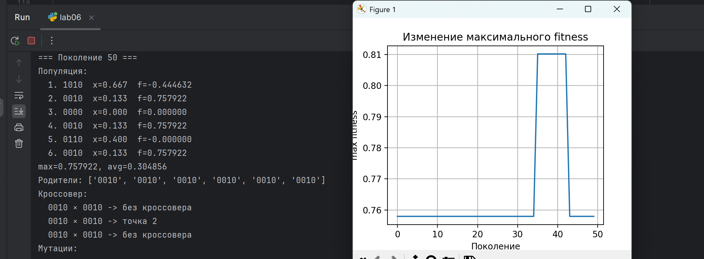
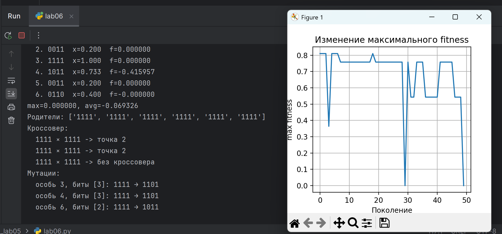
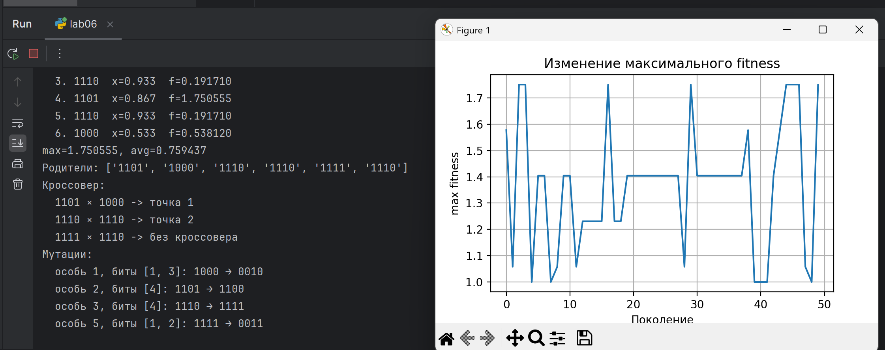
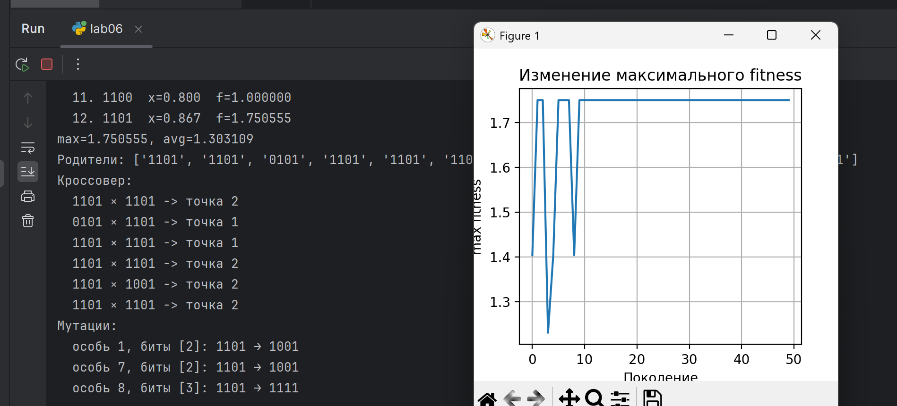

# Лабораторная работа №6. 
## Реализация и исследование параметров генетического алгоритма

 - **Калинкова София, I2302** 
 - **Вариант 2. f(x) = e^(-x) * sin(5 * pi * x)**

## Цель:

Ознакомиться с принципами работы генетических алгоритмов (ГА) как метода эволюционной оптимизации. Изучить влияние основных параметров — вероятности кроссовера ( pc ), вероятности мутации ( pm ) и размера популяции ( N ) — на эффективность поиска оптимального решения.

## Ход работы

### Теоретическая справка

**Генетический алгоритм (ГА)** — стохастический оптимизационный метод, имитирующий естественный отбор: набор возможных решений кодируется хромосомами, популяция эволюционирует поколение за поколением под действием операторов селекции, кроссовера и мутации.

Селекция выбирает родителей с учётом их приспособленности (fitness), кроссовер комбинирует части хромосом родителей (появляются новые комбинации генов), мутация вносит случайные поправки (поддерживает разнообразие). Параметры pc и pm контролируют интенсивность обмена генами и случайных изменений — они напрямую влияют на скорость сходимости и вероятность попадания в глобальный/локальные оптимумы.

### Решение 

#### Параметры генетического алгоритма:

**Целевая функция: f(x) = e^(-x) · sin(5πx)**

- Размер популяции: N = 4 (диапазон 2-20, Количество особей в
популяции)
- Длина хромосомы: L = 4 бита (фиксировано. Количество бит для кодирования переменной) 
- Вероятность кроссовера: p_c = 0.8 (0-1 , Вероятность применения оператора скрещивания)
- Вероятность мутации: p_m = 0.05 на бит (0-1,Вероятность изменения каждого бита)
- Количество поколений: G ≥ 30 (Количество циклов
эволюции)
- Кодирование: x = dec/(2^L - 1) = dec/15, где dec - десятичное значение бинарной строки

####  1. Начальная популяция

| Индивид | Хромосома (bin) | dec | x = dec/15 |
| ------: | :-------------: | --: | ---------: |
|      C1 |       0000      |   0 |   0.000000 |
|      C2 |       0101      |   5 |   0.333333 |
|      C3 |       1010      |  10 |   0.666667 |
|      C4 |       1111      |  15 |   1.000000 |

#### 2. Вычисление fitness для начальной популяции

f(x) = e^(-x) · sin(5πx)

Вычисления (округлены до 6 знаков):

**C1:** x = 0
sin(5π·0) = 0 ⇒ f₁ = e⁰ · 0 = **0.000000**

**C2:** x = 5/15 = 0.333333
5πx = 5π/3
sin(5π/3) ≈ -0.8660254038
e^(-0.333333) ≈ 0.7165313106
f₂ ≈ 0.7165313106 · (-0.8660254038) = **-0.620534**

**C3:** x = 10/15 = 0.666667
5πx = 10π/3
sin(10π/3) = sin(10π/3 - 2π) = sin(4π/3) ≈ -0.8660254038
e^(-0.666667) ≈ 0.5134171190
f₃ ≈ 0.5134171190 · (-0.8660254038) = **-0.444632**

**C4:** x = 1
sin(5π·1) = sin(5π) = 0 ⇒ f₄ ≈ **0** (≈ 2.25·10⁻¹⁶, практически ноль)

**Сводка значений fitness:**
f(C1) = 0.000000
f(C2) = -0.620534
f(C3) = -0.444632
f(C4) = 0.000000

#### 2.1. Подготовка рулеточной селекции (коррекция при отрицательных fitness)

Рулетка требует неотрицательных весов. Минимум f_min = -0.620534.
Делаем сдвиг: shift = -f_min + ε (ε = 10⁻¹²).

**Сдвинутые значения и вероятности:**

- C1: f_adj ≈ 0.620534 → p₁ ≈ 0.43793024
- C2: f_adj ≈ 1.0·10⁻¹² → p₂ ≈ 7.06·10⁻¹³ (фактически 0)
- C3: f_adj ≈ 0.175902 → p₃ ≈ 0.12413951
- C4: f_adj ≈ 0.620534 → p₄ ≈ 0.43793024

#### 3. Выбор пар родителей

Пара A: C1 = 0000 и C4 = 1111 (точка кроссовера pt = 2)
Пара B: C1 = 0000 и C2 = 0101 (точка кроссовера pt = 1)

#### 4. Кроссовер — получение потомков

**Пара A (pt=2):**

- P1 = 00|00, P2 = 11|11
- Off1 = 0011 (dec = 3 → x = 0.200000)
- Off2 = 1100 (dec = 12 → x = 0.800000)

**Пара B (pt=1):**

- P1 = 0|000, P2 = 0|101
- Off3 = 0101 (dec = 5 → x = 0.333333)
- Off4 = 0000 (dec = 0 → x = 0.000000)

**Популяция после кроссовера:**
0011 (x=0.2), 1100 (x=0.8), 0101 (x=0.333333), 0000 (x=0)

#### 5. Мутация

Потомок Off2 (1100) мутировал в бите 0:
1100 → 0100 (dec = 4 → x = 0.266667)

**Итоговая популяция после мутации:**

- Off1: 0011 → x = 0.200000
- Off2: 0100 → x = 0.266667
- Off3: 0101 → x = 0.333333
- Off4: 0000 → x = 0.000000

#### 6. Вычисление fitness для нового поколения

**Off1**: x = 0.200000
5πx = π → sin(π) = 0 ⇒ f = 0.000000

**Off2:** x = 0.266667
sin(5π·4/15) = sin(4π/3) ≈ -0.8660254
e^(-0.266667) ≈ 0.766021
f ≈ 0.766021 · (-0.8660254) ≈ -0.663313

**Off3:** x = 0.333333
f ≈ -0.620534

**Off4:** x = 0.000000
f = 0.000000

**Итоговый вектор fitness нового поколения:**
[0.000000, -0.663313, -0.620534, 0.000000]

### Программная реализация

[Код на python](main.py)

#### Вывод программы

Высокий кроссовер, малая мутация (быстрая конвергенция, риск застревания)
GA(N=6, pc=0.9, pm=0.01, G=50)

Стандартный (базовый) — для сравнения
GA(N=6, pc=0.8, pm=0.05, G=50)

Меньший кроссовер + большая мутация (медленнее, но больше разведки)
GA(N=6, pc=0.6, pm=0.15, G=50)

Влияние размера популяции — тот же pc/pm как в (2) но больше N
GA(N=12, pc=0.8, pm=0.05, G=50)

А В консоли отображается подробный ход работы генетического алгоритма по поколениям. Для каждого поколения выводятся:

- Состав популяции — бинарные хромосомы, соответствующие им фенотипы (x) и значения фитнесс-функции.
- Статистика поколения — максимальное значение фитнесс-функции и её среднее по популяции.
- Выбор родителей — список хромосом, выбранных методом отбора.
- Операции кроссовера — для каждой пары родителей: выполнялся ли кроссовер, и в какой точке.
- Операции мутаций — какие особи были изменены и какие биты были инвертированы.

## Вывод

В ходе лабораторной работы были изучены принципы функционирования генетических алгоритмов и реализован их пошаговый пример. Были рассмотрены ключевые элементы эволюционной оптимизации: кодирование решений, вычисление приспособленности, применение операторов селекции, кроссовера и мутации. На практике продемонстрировано, как начальная популяция постепенно улучшает качество решений под действием эволюционных операторов.
Полученные результаты подтвердили, что генетический алгоритм является эффективным инструментом поиска оптимальных значений в задачах, где традиционные методы затруднены или неприменимы. Работа позволила лучше понять механизмы стохастической оптимизации и влияние параметров алгоритма на скорость и качество сходимости.

## Контрольные вопросы

1. **Что представляет собой хромосома и что такое ген в контексте ГА?**  
   Хромосома — это закодированное решение задачи (обычно бинарная строка).  
   Ген — отдельный элемент хромосомы (бит или число), представляющий часть решения.

2. **Как определяется функция приспособленности (fitness)?**  
   Fitness вычисляется как значение целевой функции f(x) для конкретного индивида.  
   Она показывает, насколько это решение «хорошо» по сравнению с другими.

3. **В чём смысл операторов селекции, кроссовера и мутации?**  
   **Селекция** — выбирает лучших особей для размножения.  
   **Кроссовер** — комбинирует гены родителей, создавая новые решения.  
   **Мутация** — вносит случайные изменения, повышая разнообразие.

4. **Какое влияние оказывают параметры p_c и p_m?**  
   **p_c** (вероятность кроссовера) определяет, как часто создаются новые комбинации генов.  
   **p_m** (вероятность мутации) регулирует степень случайности и предотвращает вырождение популяции.

5. **Что такое поколение и как оно формируется?**  
   Поколение — это полный набор особей на текущем шаге алгоритма.  
   Оно формируется путём отбора родителей, выполнения кроссовера и мутаций, получая новую популяцию.

6. **Почему важно поддерживать разнообразие популяции?**  
   Потому что разнообразие:
   - предотвращает преждевременную сходимость,
   - помогает избежать локальных максимумов,
   - увеличивает шанс найти глобальное оптимальное решение.

7. **Как можно определить критерий останова эволюции?**  
   Обычно используют:
   - достижение максимального числа поколений,
   - стабилизацию лучшего fitness (нет улучшений),
   - достижение нужной точности или конкретного значения функции.