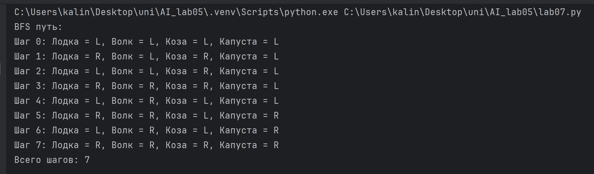
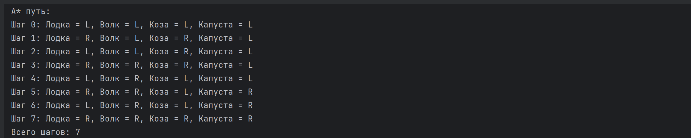
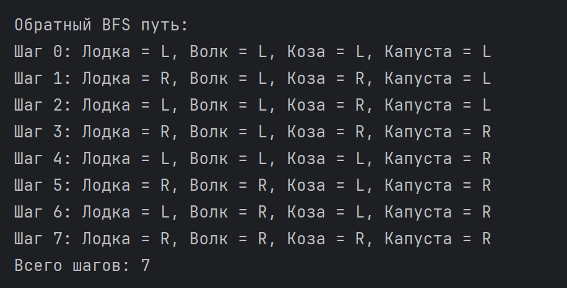

# Лабораторная работа №7. 
## Представление задачи и поиск в пространстве состояний

 - **Калинкова София, I2302** 
 - **Вариант 2. Переезд волка, козы и капусты через реку.**

## Цель:

Освоить принципы формального описания задач в терминах пространства состояний, правил переходов и стратегий контроля; разработать и реализовать алгоритм поиска решения в пространстве состояний с использованием различных стратегий и эвристик.

## Ход работы

### Теоретические основы

Любая задача в области искусственного интеллекта может быть описана как процесс переходов между состояниями, где:
- каждое состояние представляет конфигурацию системы;
- переходы определяются множеством допустимых действий;
- задача формулируется как нахождение пути из начального состояния к целевому состоянию.
Формальная постановка задачи поиска:
[Z = (S, S_0, S_G, R, C, f)]
где
- ( S ) — множество всех возможных состояний (пространство состояний),
- ( S_0 is subset S ) — множество начальных состояний,
- ( S_G is subset S ) — множество целевых (конечных) состояний,
- ( R: S -> S ) — множество правил перехода (операторов),
- ( C ) — функция стоимости перехода,
- ( f ) — стратегия или эвристика, определяющая порядок обхода состояний.

### Решение 

Вариант 2: Переезд волка, козы и капусты через реку.

#### 1. Формализация задачи

**1.1.пространство состояний в виде множества структур**

Каждое состояние можно представить как кортеж:

*(left_bank, right_bank, boat_position)*

где:

- left_bank — множество объектов на левом берегу
- right_bank — множество объектов на правом берегу
- boat_position — 'лево' или 'право'

**1.2. начальное и целевое состояния.**

- Начальное состояние (все на левом берегу):

({"волк", "коза", "капуста"}, set(), "лево")

- Целевое состояние (все на правом берегу):

(set(), {"волк", "коза", "капуста"}, "право")

**1.3. Таблица правил переходов**

| Условие                                                      | Действие                                 | Новое состояние                                              | 
| ------------------------------------------------------------ | ---------------------------------------- | ------------------------------------------------------------ | 
| Лодка находится на левом берегу, все объекты на левом берегу | Перевезти волка на правый берег          | Волк оказывается на правом берегу, лодка на правом берегу    | 
| Лодка находится на левом берегу, все объекты на левом берегу | Перевезти козу на правый берег           | Коза оказывается на правом берегу, лодка на правом берегу    | 
| Лодка находится на левом берегу, все объекты на левом берегу | Перевезти капусту на правый берег        | Капуста оказывается на правом берегу, лодка на правом берегу | 
| Лодка находится на левом берегу                              | Переправить пустую лодку на правый берег | Все объекты остаются на левом берегу, лодка на правом берегу |
| Лодка находится на правом берегу, волк на правом берегу      | Перевезти волка на левый берег           | Волк возвращается на левый берег, лодка на левом берегу      | 
| Лодка находится на правом берегу, коза на правом берегу      | Перевезти козу на левый берег            | Коза возвращается на левый берег, лодка на левом берегу      | 
| Лодка находится на правом берегу, капуста на правом берегу   | Перевезти капусту на левый берег         | Капуста возвращается на левый берег, лодка на левом берегу   | 
| Лодка находится на правом берегу                             | Переправить пустую лодку на левый берег  | Все объекты остаются на правом берегу, лодка на левом берегу | 

**1.4. допустимые и недопустимые состояния.**

- Недопустимые состояния — те, где без присмотра остаются:

    коза с волком  {"волк", "коза"}, {"капуста"}, "лево"

    коза с капустой {"коза", "капуста"}, {"волк"}, "право"

- Допустимые состояния — все остальные.

#### 2. Описание реализованных стратегий и псевдокоды.

**2.1. Стратегия 1 — Поиск в ширину (BFS)**

BFS — слепой алгоритм поиска, который последовательно исследует уровни графа от начального состояния.
Он гарантирует нахождение кратчайшего пути, если стоимость всех переходов одинаковая.

*Псевдокод BFS*

```
BFS(start, goal):
    очередь ← [start]
    посещённые ← {start}
    предки ← пустой словарь

    пока очередь не пуста:
        состояние = очередь.pop(0)

        если состояние == goal:
            вернуть восстановленный путь через предки

        для каждого соседа состояния:
            если сосед не в посещённых:
                посещённые добавить сосед
                предки[сосед] = состояние
                очередь.append(сосед)  
```

**2.2. Стратегия 3 — Эвристический поиск A***

A* использует:

- g(s): стоимость пути от начала
- h(s): эвристическую оценку расстояния до цели
- f(s) = g(s) + h(s)

была выбрана простая эвристика: h(s) = количество объектов, находящихся на левом берегу (потому что цель — перенести всех на правый берег).

*Псевдокод A* *

```
A*(start, goal):
    открытые ← приоритетная очередь, добавить start с f=0
    g[start] = 0
    предки = {}

    пока открытые не пусты:
        состояние = элемент с минимальным f

        если состояние == goal:
            вернуть путь

        для каждого соседа состояния:
            новая_стоимость = g[состояние] + 1

            если сосед не исследован или новая_стоимость < g[сосед]:
                g[сосед] = новая_стоимость
                f = g[сосед] + h(сосед)
                записать f в очередь
                предки[сосед] = состояние
```

#### 3. Вывод последовательности состояний при каждой стратегии

3.1. Последовательность состояний, найденная алгоритмом поиска в ширину (BFS)



 BFS нашёл путь оптимальной длины (7 переходов).

3.2. Последовательность состояний, найденная алгоритмом A*



 A* даёт то же оптимальное решение, но делает меньше проверок.


6. Сравнительный анализ стратегий поиска

| Параметр                        | BFS                                      | A*                                           |
| ------------------------------- | ---------------------------------------- | -------------------------------------------- |
| **Тип поиска**                  | Слепой, перебор всех уровней             | Эвристический, направленный                  |
| **Использует эвристику**        | Нет                                      | Да                                           |
| **Гарантия оптимальности**      | Да                                       | Да (при допустимой эвристике)                |
| **Скорость поиска**             | Средняя, зависит от размера пространства | Выше, чем BFS                                |
| **Число посещённых состояний**  | Максимальное (обходит уровни полностью)  | Меньше (пропускает заведомо невыгодные пути) |
| **Память**                      | Высокая (хранит целый уровень)           | Средняя                                      |
| **Вероятность зацикливания**    | Нет, если ведётся учёт посещённых        | Нет                                          |
| **Подходит для больших графов** | Плохо масштабируется                     | Гораздо лучше масштабируется                 |


#### 4. Обратный поиск (поиск от цели к источнику)**

В дополнение к прямому поиску была реализована возможность выполнять поиск от целевого состояния назад к начальному.
Метод полностью аналогичен BFS/DFS, но начальная точка — целевое состояние, а переходы инвертируются.

обратный поиск позволяет проверить симметричность пространства состояний и иногда сокращает путь, если из цели проще генерировать допустимые состояния.

псевдокод:

```
reverse_bfs(goal):
    очередь ← [goal]
    посещено ← {goal}

    пока очередь не пуста:
        s = очередь.pop()
        если s == start: вернуть путь
        для каждого предшественника p (инверсия переходов):
            если p не посещён:
                добавить p в очередь
```



### Заключение о влиянии стратегии и эвристики на эффективность поиска

Выбор стратегии поиска напрямую влияет на эффективность решения задачи.
Разные алгоритмы обходят пространство состояний по-разному, что приводит к различному количеству посещённых узлов и времени выполнения.

Слепые алгоритмы (BFS) не используют дополнительной информации о задаче и потому вынуждены перебирать множество состояний, даже если они явно не ведут к цели.

Эвристический поиск (A*) использует функцию h(s), которая направляет алгоритм в «перспективные» области поиска.
Это позволяет:
- уменьшить число проверяемых состояний;
- существенно сократить время работы;
- сохранить оптимальность найденного решения.

Правильно выбранная эвристика (в данном случае — количество объектов на левом берегу) делает алгоритм A* более эффективным по сравнению с BFS.

### Контрольные вопросы

 1. Что такое пространство состояний и как оно формируется?
**Пространство состояний** — это множество всех возможных конфигураций (состояний) задачи. Формируется через описание:
- Начального состояния
- Конечного состояния  
- Всех допустимых переходов между ними

2. Что представляют собой правила перехода и стратегия контроля?
- **Правила перехода** — набор действий, которые переводят систему из одного состояния в другое
- **Стратегия контроля** — способ выбора порядка, в котором алгоритм будет исследовать состояния

3. Чем различаются прямые и поисковые методы решения задач?
- **Прямые методы** — используют готовые формулы/правила; решение находится сразу
- **Поисковые методы** — перебирают возможные состояния, чтобы найти путь к цели

4. В чём преимущества и недостатки стратегий поиска в ширину и в глубину?
**Поиск в ширину (BFS):**
- плюс: Гарантирует кратчайшее решение
- минус: Требует много памяти

**Поиск в глубину (DFS):**
- плюс: Требует мало памяти
- минус: Может уйти в бесконечную ветку, не найдено оптимальное решение

5. Что такое эвристика? Как она влияет на процесс поиска?
**Эвристика** — это приближённая оценка расстояния до цели. Влияние:
- Направляет поиск в более перспективные состояния
- Ускоряет работу алгоритма

6. Почему важно выбирать эффективное представление состояний?
Правильная структура данных:
- Облегчает проверку, поиск, хранение и сравнение состояний
- Уменьшает время работы и потребление памяти

7. Что означает зацикливание в пространстве поиска и как его предотвратить?
**Зацикливание** — повторное посещение уже известных состояний.  
**Предотвращение:** хранение посещённых состояний (closed set)
