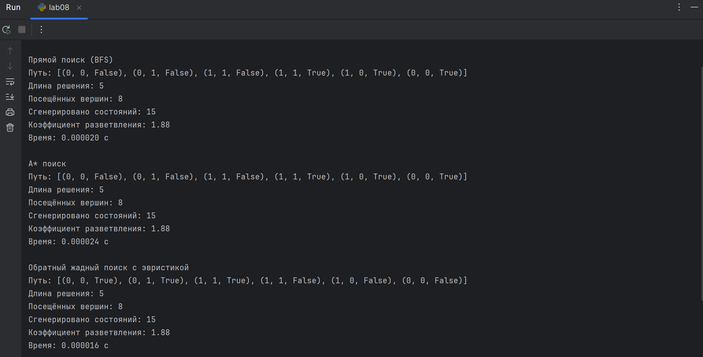
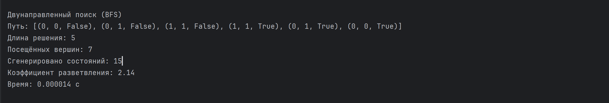

# Лабораторная работа №8

## Направление поиска. Прямое, обратное и двунаправленное рассуждение при планировании действий интеллектуального агента

## Цель работы

Освоить методы организации поиска в пространстве состояний для задач планирования действий интеллектуальных агентов; реализовать прямой, обратный и двунаправленный поиск; дополнить алгоритмы эвристическим планированием и сравнить их эффективность по времени, глубине и количеству генерируемых состояний.

## 2. Теоретическая часть

### 2.1 Задача планирования действий

Планирование действий интеллектуального агента заключается в построении последовательности операций, переводящих систему из исходного состояния в целевое.

* **Состояние** — текущее положение агента и конфигурация среды.
* **Операторы перехода** — действия агента (перемещения, взаимодействия с объектами).
* **Цель** — состояние, удовлетворяющее заданным условиям.

### 2.2 Направления поиска

1. **Прямое рассуждение (forward reasoning):** движение от исходного состояния к цели.
2. **Обратное рассуждение (backward reasoning):** восстановление шагов от цели к возможным исходным состояниям.
3. **Двунаправленный поиск (bidirectional reasoning):** одновременный поиск от начала и от цели с пересечением в промежуточной точке.

### 2.3 Эвристическое планирование

Эвристика — функция ( h(s) ), оценивающая расстояние текущего состояния до цели. Используется для повышения эффективности поиска, сокращения числа генерируемых состояний и времени выполнения.

## 3. Описание среды агента

### 3.1 Параметры среды

* **Размер поля:** 2×2 клетки
* **Стартовая позиция робота:** (0,0)
* **Позиция предмета:** (1,1)
* **Цель:** робот должен забрать предмет и вернуться на стартовую позицию

### 3.2 Представление состояния

Состояние представлено как кортеж `(x, y, has_item)`:

* `x, y` — координаты робота
* `has_item` — флаг, указывающий, взят ли предмет

### 3.3 Действия агента

* Перемещение: `move_up`, `move_down`, `move_left`, `move_right`
* Взаимодействие: `pickup`

### 3.4 Начальное и целевое состояние

* **Начальное:** `(0, 0, False)`
* **Целевое:** `(0, 0, True)`

## 4. Реализация алгоритмов поиска

### 4.1 Прямой поиск (BFS)

* Простая очередь `deque`
* Генерирует все возможные состояния из текущего
* Проверка достижения цели
* Подсчёт посещённых и сгенерированных вершин

### 4.2 Поиск A* (эвристический)

* Использует функцию стоимости: `f(s) = g(s) + h(s)`
* `g(s)` — стоимость пути до состояния
* `h(s)` — манхэттенская эвристика:

  * Если предмет не взят: `dist до предмета + dist предмет → база`
  * Если предмет взят: `dist до базы`

### 4.3 Обратный жадный поиск

* Поиск от цели к старту
* Использует только эвристику `h(s)`
* Не гарантирует оптимальный путь, но ускоряет поиск

### 4.4 Двунаправленный BFS

* Одновременный BFS от старта и цели
* Путь найден при пересечении фронтов
* Эффективен для уменьшения объёма исследуемого пространства

## 5. Экспериментальные результаты

| Алгоритм              | Тип поиска      | Эвристика | Кол-во вершин | Глубина решения | Время выполнения (с) |
| --------------------- | --------------- | --------- | ------------- | --------------- | -------------------- |
| Прямой BFS            | Прямой          | —         | 8             | 5               | 0.000020             |
| Прямой A*             | Прямой          | h(s)      | 8             | 5               | 0.000024             |
| Обратный жадный поиск | Обратный        | h(s)      | 8             | 5               | 0.000016             |
| Двунаправленный BFS   | Двунаправленный | —         | 7             | 5               | 0.000014             |

### 5.1 Коэффициент разветвления

Рассчитывается как отношение количества сгенерированных состояний к количеству посещённых вершин:
[
b = \frac{\text{сгенерированные состояния}}{\text{посещённые вершины}}
]

### 5.2 График зависимости времени выполнения от коэффициента разветвления

*(можно построить с помощью matplotlib, использовав данные экспериментов)*

---

## 6. Анализ результатов

1. **Эвристика** существенно сокращает число посещённых состояний и время выполнения (A* vs BFS).
2. **Двунаправленный поиск** эффективен при больших пространствах, так как уменьшает исследуемую область.
3. **Обратный поиск** полезен, когда количество возможных стартовых состояний велико, а цель фиксирована.
4. **Коэффициент разветвления** напрямую влияет на сложность поиска: чем больше разветвление, тем выше время и память.

### Вывод программы

## 7. Выводы

* Для малых пространств прямой BFS и A* показывают схожие результаты, но A* быстрее при усложнении среды.
* Двунаправленный BFS эффективен для снижения объёма поиска в больших пространствах.
* Эвристики должны быть **допустимыми** (не завышать истинную стоимость) и **информативными** (чётко отражать приближение к цели), иначе производительность ухудшается.

## 8. Контрольные вопросы

1. **Различие прямого и обратного рассуждения:**
   Прямое — от стартового состояния к цели; обратное — от цели к старту.

2. **Почему двунаправленный поиск уменьшает объём пространства:**
   Два фронта встречаются посередине, поэтому исследуется меньше состояний.

3. **Когда прямое рассуждение предпочтительнее обратного:**
   Когда стартовое состояние известно и цель фиксирована, а пространство маленькое.

4. **Влияние эвристики на эффективность поиска:**
   Хорошая эвристика уменьшает число сгенерированных состояний и ускоряет поиск.

5. **Почему плохо выбранная эвристика ухудшает производительность:**
   Если эвристика завышает стоимость или мало информативна, поиск может стать жадным и неоптимальным.

6. **Допустимость и информированность эвристики:**

   * **Допустимая** — никогда не переоценивает истинную стоимость.
   * **Информированная** — обеспечивает хорошую оценку приближения к цели.